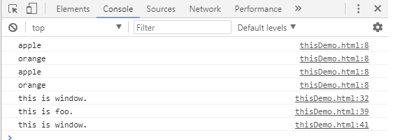
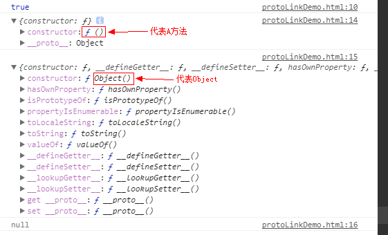
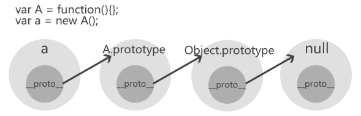

# JS this constructor prototype

　　这三个属性困获了我好久，尤其是在ESMAClass中那个构造方法和原型混用中，一直不明白为什么重写了prototype引用但确不会影响this中定义的属性。所以就单独出来一个做了一个详细调查。

## This

　　this定义：this就是函数赖以执行的对象。

1. this是一个对象
2. this这个对象是谁，依赖函数执行的上下文环境
3. 每个函数都有一个this用来传递上下文

```js
// 定义一个全局函数
function foo() {
  console.log(this.fruit);
}

// 定义一个全局变量，等价于window.fruit = "apple";
var fruit = "apple";

// 此时函数foo中this指向window对象
// 这种调用方式和window.foo();是完全等价的
foo(); // "apple"

// 自定义一个对象，并将此对象的属性foo指向全局函数foo
var pack = {
  fruit: "orange",
  foo: foo
};

// 此时函数foo中this指向window.pack对象
pack.foo(); // "orange"

// 等价于window.foo();
foo.apply(window); // "apple"

// 此时foo中的this === pack
foo.apply(pack);  // "orange"

// 定义一个全局函数
function foo1() {
  if (this === window) {
    console.log("this is window.");
  }
}

// 函数foo也是对象，所以可以定义foo的属性boo为一个函数
foo1.boo = function() {
  if (this === foo1) {
    console.log("this is foo.");
  } else if (this === window) {
    console.log("this is window.");
  }
};
// 等价于window.foo();
foo1(); // this is window.

// 可以看到函数中this的指向调用函数的对象
foo1.boo(); // this is foo.

// 使用apply改变函数中this的指向
foo1.boo.apply(window); // this is window.
```

　　运行控台输出：



代码示例见 [ThisDemo](thisDemo.html)


**事件中的 this**

在 HTML 事件句柄中，this 指向了接收事件的 HTML 元素：

```js
<button onclick="this.style.display='none'">
点我后我就消失了
</button>
```

## constructor prototype

　　这两个关系较为紧密，可以这样讲constructor是存在于prototype中的一个属性，用来指向创建对象的构造函数。

1. constructor是一个对象属性
2. constructor在prototype中
3. constructor始终指向创建当前对象的构造函数

　　示例 1:

```
function Person(name, age){
    this.name = name;
    this.age = age;
}
Person.prototype.getName = function(){
    alert(this.name);
}
Person.prototype.getAge = function(){
    alert(this.age);
}
var obj = new Person();
alert(obj.constructor == Person);// true 表明指向的是Person函数
```

[Demo Code](constructorModelDemo.html)

　　示例 2：prototype对象被如下代码覆盖

```
function Person(name, age){
    this.name = name;
    this.age = age;
}
Person.prototype = {
    getName: function(){
       alert(this.name);
    },
    getAge: function(){
       alert(this.age);
    }
}
var obj = new Person();
alert(obj.constructor == Person);// false 表明现在不再指向Person函数
```

[Demo Code](constructorModelDemo1.html)

　　Person.prototype = {...}的实际操做如下：

```
Person.prototype = new Object({
  getName: function() {
    return this.name;
  }
});
```

　　即本质没有改变，prototype.constructor依然会指向创建当前对象的构造函数。只是此时的构造函数是Object,上面的代码覆写了prototype.constructor的值。如下程序会证明：

```
function Person(name) {
  this.name = name;
};
Person.prototype = {
  getName: function() {
    return this.name;
  }
};
var p = new Person("haorooms");
console.log(p.constructor === Object); // true
console.log(Person.prototype.constructor === Object); // true
console.log(p.constructor.prototype.constructor === Object); // true
```

[Demo Code](constructorModelDemo2.html)

　　所以知道问题所在，那么想让其指向我们期望值只需要将prototype.constructor指向我们期的地方即可，如下所示：

```
function Person(name) {
  this.name = name;
};
Person.prototype = {
  getName: function() {
    return this.name;
  }
};
Person.prototype.constructor = Person;
var p = new Person("haorooms");
console.log(p.constructor === Person); // true 代表指向了Person函数
console.log(Person.prototype.constructor === Person); // true 代表指向了Person函数
console.log(p.constructor.prototype.constructor === Person); // true 代表指向了Person函数

或

function Person(name) {
  this.name = name;
};
Person.prototype = {
  constructor:Person,//指定constructor
  getName: function() {
    return this.name;
  }
};
var p = new Person("haorooms");
console.log(p.constructor === Person); // true 代表指向了Person函数
console.log(Person.prototype.constructor === Person); // true 代表指向了Person函数
console.log(p.constructor.prototype.constructor === Person); // true 代表指向了Person函数
```

[Demo Code](constructorModelDemo3.html)

　　prototype是一个函数属性, 此属性同时也是一个对象, 保存着对象实例所共有的属性和方法。

　　分析这句话:

1. prototype是函数属性, 只要是函数, 就有prototype属性. 而不管是构造函数还是普通函数.
2. prototype同时也是对象.
3. prototype放的是公共的东西, 包括属性和方法.

　　示例：

```
function Person(name, age){
    this.name = name;
    this.age = age;
}

//是函数就有prototype属性, 这个属性也是一个对象
Person.prototype = {
    getName: function(){ //所有对象实例都共享
        return this.name;
    },
    getAge: function(){//所有对象实例都共享
        return this.age;
    }
}

var obj = new Person('tom', 23);
obj.getName(); //'tom'
var obj2 = new Person('jack', 23);
obj2.getName(); //'jack'
obj.getName == obj2.getName; //true, 所有实例共享
Person.prototype.getName(); //当做普通函数属性, 根据this定义, 此时this指向的是Person.prototype, 所以返回undefined
```

[Demo Code](prototypeDemo.html)

　　从上面的示例可以看出this是运行时上下文环境对象，而prototype是函数的属性对象。他们两个的区别如下所示：

　　区别1：this定义的方法可以访问构造方法里的局部变量，而prototype定义的方法不能访问。

```
function ListCommon2(afirst)
{
   var first = afirst;
   this.do1 = function ()
   {
     alert("first do"+first);
   };

}

ListCommon2.prototype.do2=function()
{
   alert("first do"+first);//会出错，不能访问first, Uncaught ReferenceError: first is not defined
   //this.do1();  // 通过调用 都do1()方法，间接的来访问 first属性。
}

var listObj = new ListCommon2('test');
listObj.do1();
listObj.do2();
```

[Demo Code](differentDemo.html)

　　区别2：当访问对象的属性或者方法是，将按照搜索原型链prototype chain的规则进行。首先查找自身的静态属性、方法，继而查找构造上下文的可访问属性、方法，最后查找构造的原型链。

```
function Test() {
   this.func = function() {
     alert("defined by this");
   };
}

Test.prototype.func = function() {
   alert("defined by prototype");
};

var _o = new Test();
_o.func(); //输出“defined by this”
```
[Demo Code](differentDemo1.html)

　　区别3：“this”与“prototype”定义的另一个不同点是属性的占用空间不同。使用“this”关键字，示例初始化时为每个实例开辟构造方法所包含的所有属性、方法所需的空间，而使用“prototype”定义，由于“prototype”实际上是指向父级的一种引用，仅仅是个数据的副本，因此在初始化及存储上都比“this”节约资源。

# 原型链

　　由于_proto_是任何对象都有的属性，而JS里万物皆对象，所以会形成一个_proto_链条，当JS引擎查找对象的属性和方法时，先查找对象本身是否存在该属性或方法，如果不存在，会在原型链上查找，但不会查找自身的prototype。

　　按上所述，this是给上下文环境即自身添加属性或方法，而prototype是给函数添加属性和方法，优先级低于this添加的。上面区别2中的DEMO已经证明了该点。

　　\_proto\_属性指向实例对象的构造函数的原型，理解起来就如下：

```
function Person(){};
var p = new Person();
console.log(p.__proto__ === Person.prototype)//true
```

　　所以如下代码码的原形链为：a.\_proto\_=A.prototype; A.prototype.\_proto\_=Object.prototype; Object.prototype.\_proto\_=null

```
var A = function(){};
var a = new A();
console.log(a.__proto__); //A {}（即构造器function A 的原型对象）
console.log(a.__proto__.__proto__); //Object {}（即构造器function Object 的原型对象）
console.log(a.__proto__.__proto__.__proto__); //null
```

　　[Demo Code](differentDemo1.html)

　　Demo输出为



　　proto链如下图所示：



# instanceof究竟是运算什么的？

　　我曾经简单理解instanceof只是检测一个对象是否是另个对象new出来的实例（例如var a = new Object()，a instanceof Object返回true），但实际instanceof的运算规则上比这个更复杂。

　　实际流程如下：

```
//假设instanceof运算符左边是L，右边是R
L instanceof R

//instanceof运算时，通过判断L的原型链上是否存在R.prototype
L.__proto__.__proto__ ..... === R.prototype ？
//如果存在返回true 否则返回false
```

注意：instanceof运算时会递归查找L的原型链，即L.__proto__.__proto__.__proto__.__proto__...直到找到了或者找到顶层为止。

　　所以一句话理解instanceof的运算规则为：instanceof检测左侧的__proto__原型链上，是否存在右侧的prototype原型。
