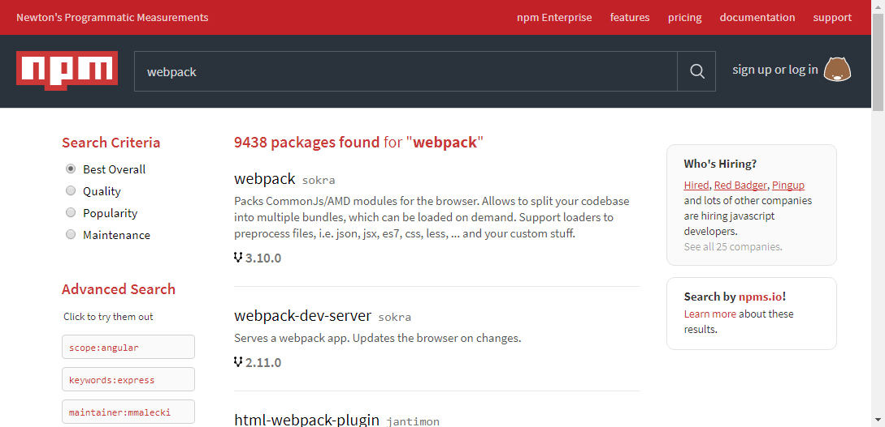
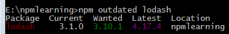
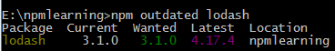
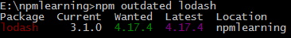
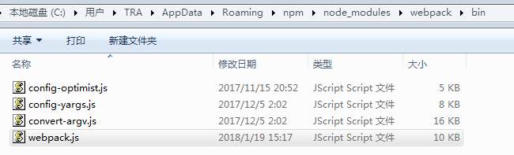

# 什么是npm

**使用npm的时候需要世装node.js**

官方解释如下：

>npm makes it easy for JavaScript developers to share and reuse code, and it makes it easy to update the code that you’re sharing.

　　在程序开发中我们常常需要依赖别人提供的框架，写 JS 也不例外。这些可以重复的框架代码被称作包（package）或者模块（module），一个包可以是一个文件夹里放着几个文件，同时有一个叫做 package.json 的文件。

　　一个网站里通常有几十甚至上百个 package，分散在各处，通常会将这些包按照各自的功能进行划分（类似我们安卓开发中的划分子模块），但是如果重复造一些轮子，不如上传到一个公共平台，让更多的人一起使用、参与这个特定功能的模块。

　　而 npm 的作用就是让我们发布、下载一些 JS 轮子更加方便。

　　我们可以去官方网站 https://www.npmjs.com/ 浏览、搜索想要的轮子，也可以直接在命令行中 search 一下意中轮。



# 更新npm

和更新其它js模块安装方式一样，即重新安装一个新版本的npm，使用命令 **npm install packageName@version** 命令更新npm。 -g代表全局安装

`
npm install npm@latest -g
`

# package.json 文件

　　**管理本地安装 npm 包的最好方式就是创建 package.json 文件。**

　　你所写的每一个项目其实都可以看成一个包，只是你的包中有你的业务逻辑。

　　一个 package.json 文件可以有以下几点作用：

1. 作为一个描述文件，描述了你的项目依赖哪些包
2. 允许我们使用 “语义化版本规则”（后面介绍）指明你项目依赖包的版本
3. 让你的构建更好地与其他开发者分享，便于重复使用

　　使用 **npm init** 可以在当前目录创建package.json

# package.json 内容

　　如下示例所示其中包括如下内容：

1. name:全部小写，没有空格，可以使用下划线或者横线
2. version:x.x.x 的格式, **符合“语义化版本规则”**
3. description：描述信息，有助于搜索
4. main: 入口文件，一般都是 index.js。简而言之，当别人安装了你发布的模块时，require你的模块的时候取得的就是你main字段规定的入口文件的输出。例如你写入了 { "main":"XXX.js"}，而他人通过npm install '你的模块名称' . 安装了你的模块后，他通过 var X = require('你的模块名称')取得的就是你在XXX.js的输出
5. scripts：写进scripts的命令(command),可以通过npm run <command>或者npm <command> 运行对应的shell指令，例如：{"scripts": { "start": "node main.js"} } 可以让你在终端输入npm start的时候，等同于运行了node main.js
6. keywords：关键字，有助于在人们使用 npm search 搜索时发现你的项目
7. author：作者信息
8. license：默认是 ISC
9. bugs：当前项目的一些错误信息，如果有的话
10. dependencies：在生产环境中需要用到的依赖
11. devDependencies：在开发、测试环境中用到的依赖

```
{
  "name": "firstwebpack",
  "version": "1.0.0",
  "description": "first webpack demo",
  "main": "index.js",
  "scripts": {
    "start": "webpack",
    "build": "webpack",
    "server": "webpack-dev-server --open"
  },
  "repository": {
    "type": "git",
    "url": "www"
  },
  "keywords": [
    "first"
  ],
  "author": "lear521@163.com",
  "license": "MIT",
  "devDependencies": {
    "babel-core": "^6.26.0",
    "babel-loader": "^7.1.2",
    "babel-preset-es2015": "^6.24.1",
    "babel-preset-react": "^6.24.1",
    "webpack": "^3.8.1",
    "webpack-dev-server": "^2.9.5"
  },
  "dependencies": {
    "react": "^16.2.0",
    "react-dom": "^16.2.0",
    "react-router": "^4.2.0",
    "react-router-dom": "^4.2.2"
  }
}

```

　　如果在你的项目里有 package.json 文件，运行 *npm install* 后它会自动查找package.json文件中列出的依赖包，然后下载符合语义化版本规则的版本。

　　**npm install 默认会安装 package.json 中 dependencies 和 devDependencies 里的所有模块。**

　　如果想只安装 dependencies 中的内容，可以使用 --production 字段：　`npm install --production`

# Semantic versioning（语义化版本规则）

　　从上面示例我们可以看到依赖中的内容是`"react": "^16.2.0"` 的形式。我们知道 key 是依赖的包名称，value 是这个包的版本。那版本前面的 ^ 或者版本直接是一个 * 是什么意思呢？

　　这就是 npm 的 “Semantic versioning”，简称”Semver”，中文含义即“语义化版本规则”。


**npm 包提供者应该注意的版本号规范：**

　　如果一个项目打算与别人分享，应该从 1.0.0 版本开始。以后要升级版本应该遵循以下标准：

　　补丁版本：解决了 Bug 或者一些较小的更改，增加最后一位数字，比如 1.0.1

　　小版本：增加了新特性，同时不会影响之前的版本，增加中间一位数字，比如 1.1.0

　　大版本：大改版，无法兼容之前的，增加第一位数字，比如 2.0.0
了解了提供者的版本规范后， npm 包使用者就可以针对自己的需要填写依赖包的版本规则。

　　作为使用者，我们可以在 package.json 文件中写明我们可以接受这个包的更新程度（假设当前依赖的是 1.0.4 版本）：

　　如果只打算接受补丁版本的更新（也就是最后一位的改变），就可以这么写：

```
1.0
1.0.x
~1.0.4
```

　　如果接受小版本的更新（第二位的改变），就可以这么写：

```
1
1.x
^1.0.4
```
　　如果可以接受大版本的更新（自然接受小版本和补丁版本的改变），就可以这么写：
```
*
x
```
> 小结一下：总共三种版本变化类型，接受依赖包哪种类型的更新，就把版本号准确写到前一位。

# 安装package

　　使用 npm 安装 package 有两种方式：本地（当前项目路径）安装 或者 全局安装。

　　本地模式：npm install moduleName 安装模块，安装完毕后会产生一个node_modules目录，其目录下就是安装的各个模块。

　　全局模式：npm install moduleName -g 包会被安装到Node的安装目录下的node_modules下。

完整命令如下所示，[]表示可选

```
npm install moduleName[@version] [-g]

version常见的添加方式如下
$ npm install sax@latest
$ npm install sax@0.1.1
$ npm install sax@">=0.1.0 <0.2.0"
```

**注：但是代码中，直接通过require()的方式是没有办法调用全局安装的包的。全局的安装是供命令行使用的，就好像全局安装了vmarket后，就可以在命令行中直接运行vm命令。所以安装的时候一定要想清楚是代码中使用还是命令行中使用**

## 安装参数 --save 和 --save-dev

　　添加依赖时我们可以手动修改 package.json 文件，添加或者修改 dependencies devDependencies 中的内容即可。

　　另一种方式是用命令行，在使用 npm install 时增加 `--save` 或者 `--save-dev` 后缀：

1. npm install <package_name> --save 表示将这个包名及对应的版本添加到 package.json的 dependencies

2. npm install <package_name> --save-dev 表示将这个包名及对应的版本添加到 package.json的 devDependencies

# npm outdated更新操作

　　有时候我们想知道依赖的包是否有新版本，可以使用 npm outdated 查看，如果发现有的包有新版本，就可以使用 npm update <package-name> 更新它，或者直接 npm update 更新所有。如果真接使用npm outdate lodash更新会更新到Wanted指定的版本，如下图所示。



　　而Wanted指定的版本是由npm update的工作过程来确定的：

1. 先到远程仓库查询最新版本
2. 然后对比本地版本，如果本地版本不存在，或者远程版本较新
3. 查看 package.json 中对应的语义版本规则
4. 如果当前新版本符合语义规则，就更新，否则不更新

　　我们示例如下，表示只能受小版本更新，所以Wanted只能达到3.X.X的上限，即3.10.1。

```
"devDependencies": {
   "lodash": "^3.1.0"
 }
```

　　如果我们改成 `"lodash": "~3.1.0"`即我们只接受补丁更新，看到的是如下图所示为3.1.0：



　　同理，如果想更新到Latest那么只需要改成`"lodash": "*"`



**注：只有当前模块版本低于远程，package.json 中的版本语义规则满足情况，才能更新成功。**

　　想知道哪些包需要更新，可以使用 npm outdated -g --depth=0，然后使用 npm update -g <package>更新指定的包

# 卸载本地package

　　卸载一个本地 package 很简单，npm uninstall <package-name> 即可

# 全局安装的权限问题

　　在全局安装时可能会遇到 EACCES 权限问题，解决办法办法有如下 3 种：

1. sudo npm install -g jshint，使用 sudo 简单粗暴，但是治标不治本

2. 修改 npm 全局默认目录的权限

　　先获取 npm 全局目录：npm config get prefix，一般都是 /usr/local；

　　然后修改这个目录权限为当前用户：
```
 sudo chown -R $(whoami) $(npm config get prefix)/{lib/node_modules,bin,share}
```

3. 使用其他包管理器帮你解决这个问题

　　实在懒得弄可以直接卸载 node，然后使用 Homebrew 重装 node:

　　brew install node

　　Homebrew 会帮我们处理好权限的问题。

#　卸载全局的 package

　　卸载全局：npm uninstall -g <package>

# npm run

npm 还可以直接运行 package.json 中 scripts 指定的脚本。比如使用了webpack，我们想启动webpack可以直接使用 `npm run start`。但start是内部处理过的，所以可以省略变为npm start但如果要启动server则需要使用`npm run server`。

```
"scripts": {
    "start": "webpack",
    "server": "webpack-dev-server --open"
  }
```

　　通过script字段内的npm命令运行脚本时，有时候要加“run”，有时候又不要加"run",即有时候是可以直接用npm <command>；而有时候又要用npm run <command> 才能运行脚本，这该如何区分呢？

　　首先要提一下的是，run的原名是run-script，是一段脚本，而run是它的一个别名（alias）

　　当run[-script]被 test, start, restart, and stop这四个自带的命令所使用时，它可以被省略（或者说不需要加“run”就可以直接调用），所以我们平时最常输入的npm start实际上相当于npm run start，只不过是为了方便省略了run而已

　　**原文：run[-script] is used by the test, start, restart, and stop commands, but can be called directly**

　　**另外npm start是有默认值的，默认为：node server.js**

　　**package.json 中的 scripts 执行的脚本是包安装目录内 node_modules -> .bin 内的脚本。如webpack（windows下全局安装）目录内的bin如下图所示：**



# npm other command

1.  从github下载

```
$ npm install git://github.com/package/path.git
$ npm install git://github.com/package/path.git#0.1.0
```

2. npm info <package-name> 可以查看指定包的信息
3. npm prune 可以检查出当前项目的 node_modules目录中，没有在 package.json里提到的模块。并修剪掉。


# 国内镜像

　　不翻的话有时候 npm 比较卡，可以使用国内的淘宝镜像 cnpm： https://npm.taobao.org。

　　cnpm 支持 npm 除了 publish 之外的所有命令。

参考链接: [ npm 与 package.json 快速入门](http://blog.csdn.net/u011240877/article/details/76582670);
[package json介绍](https://www.cnblogs.com/penghuwan/p/7134046.html)
