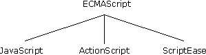
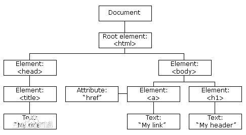

# 简介

　　本文用以记录从0开始学习JS，将学习过程中迷惑的点以学习笔记的方式进行记录，并以时间为顺序进行排序。文中一级目录都是笔者在学习过程中遇到的问题,大部分内容并非原创，而是遇到后网上查阅并做以整理，所以如果看到似曾相识还请见谅，但我还是很感谢大家写的各种blog分享你们的知识。

　　本文包括JS、ES6、React、NodeJs、Bootstrap、Webpack等基础知识。

　　本文会略掉一些个人觉得不重要的概念，比如什么叫做变量，JS循环等操作语法。学过一种编程语言的应该很容易上手JS这些基本语法。

# ECMAScript(ES)

　　是JS标准，规定了JS的变量写法、语法规范、支持数据类型、有那些关键字和保留等。也就是说是一个用来统一JS语法或特性的标准。Web浏览器一般将ECMAScript做为JavaScript实现的基础。

　　简单地说，ECMAScript 描述了以下内容：语法、类型、语句、关键字、保留字、运算符、对象。ECMAScript 仅仅是一个描述，定义了脚本语言的所有属性、方法和对象。其他语言可以实现 ECMAScript 来作为功能的基准。

> 个人感觉有些像是JAVA的JDBC，JDBC只定义了每个接口功能意义，由不同的数据库商自行实现。ECMAScript定义其语法语义和特性，其它商家去实现然后可能会有扩展。如下图所示：

> 

> 更多详细内容可以参见： [ECMAScript 历史与实现](http://www.w3school.com.cn/js/pro_js_implement.asp)

　　所以JavaScript也只是ECMAScript的一个实现，但JavaScript并不是只由ECMAScript组成，而是由下面三个部分组成：

1. JavaScript 的核心 ECMAScript 描述了该语言的语法和基本对象；
2. DOM 描述了处理网页内容的方法和接口；
3. BOM 描述了与浏览器进行交互的方法和接口。

# JavaScript

　  JS，是JavaScript的缩写形式。JS可以理解成为一种用来依据事件或依据数据进行条件判断进而操作HTML DOM的脚本语言。比如增、删、隐藏、改变显示样式（即改变CSS）等操作。有如下比喻还是比较形像：

  > 如果把网站建设比喻成盖楼房，那么HTML就是这个楼房的钢筋水泥，CSS就是楼房的布局装饰，而JS就是楼房中大大小小无处不在的开关了。从这样的角度而言，JS就是Web开发中负责逻辑层的语言，而现如今相当火热的“用户体验”的概念，最重要的代码部分还是需要JS来编写。

　　从上面的比喻可以清析的知道，HTML是用来做各种布局控制，CSS用来做各种效果渲染的。JS就是用来操控HTML和CSS。**但其实JS还会向后端发送请求获取数据，然后依据数据重新操作HTML和CSS再次渲染界面**。

　　也就是说HTML+CSS只是一个静态的HTML页面，而各种交互效果比如点击响应，图片切换等需要使用JS，即JS用来操作这些页面无素（DOM元素）。所以需要注意只要结构加载完的页面元素才可以获取到，这也就是为什么CSS会放在HTML BODY体头而JS放到HTML BODY尾的一个原因。**目前大部分项目会把CSS引入放到BODY 中的Head里，而JS引入放到BODY尾**

> 如果把JS放到了HTML头，可以使用如下方式等到所有结构加载完成后再加载JS
> 1. JS： window.onload=function(){}，是JS的标准做法，等页面所有资源文件都加载完成后再执行
> 2. JQ：$(document).ready(function(){}),是JQuery的方式
> 3. window.addEventListenner('load', function(){}, false), 但这咱方式不兼容IE 6 7 8.
> 4. IE 6 7 8下 window.attachEvent('onreadystatechange',function(){})

[浏览器判断方法](JudgeBrowserAndVersion)

# DOM

　　文档对象模型（Document Object Model，简称DOM），是 HTML 和 XML 的应用程序接口（API）。DOM 将把整个页面规划成由节点层级构成的文档。HTML 或 XML 页面的每个部分都是一个节点的衍生物。即用来表示文档中对象的标准模型就称为DOM。HTML的DOM如下图所示：



　　DOM 通过创建树来表示文档，从而使开发者对文档的内容和结构具有空前的控制力。用 DOM API 可以轻松地删除、添加和替换节点。*即如何去控制HTML文档*。（更多细节参考 [DOM细节](http://www.w3school.com.cn/js/pro_js_implement.asp#DOM)）

>个人理解：DOM就是一些API和属性并描述API功能和属性的作用，告诉大家那些接口功能是做什么使用后有什么效果，从属性中能拿到那些数据，这些数据。让不同的开发商去实现有标准含义的接口。比如Netscape和微软，他们实现的DOM接口必需要符合W3C所定义的DOM API和属性

# BOM

　　浏览器对象模型（Browser Object Model，简称BOM）：可以对浏览器窗口进行访问和操作。使用 BOM，开发者可以移动窗口、改变状态栏中的文本以及执行其他与页面内容不直接相关的动作。使 BOM 独树一帜且又常常令人怀疑的地方在于，它只是 JavaScript 的一个部分，没有任何相关的标准。

　　BOM 主要处理浏览器窗口和框架，不过通常浏览器特定的 JavaScript 扩展都被看做 BOM 的一部分。这些扩展包括：

1. 弹出新的浏览器窗口
2. 移动、关闭浏览器窗口以及调整窗口大小
3. 提供 Web 浏览器详细信息的定位对象
4. 提供用户屏幕分辨率详细信息的屏幕对象
5. 对 cookie 的支持
6. IE 扩展了 BOM，加入了 ActiveXObject 类，可以通过 JavaScript 实例化 ActiveX 对象

　　由于没有相关的 BOM 标准，每种浏览器都有自己的 BOM 实现。有一些事实上的标准，如具有一个窗口对象和一个导航对象，不过每种浏览器可以为这些对象或其他对象定义自己的属性和方法。

> 理解可以参见BOM的个人理解部分，两者应该一样。只是操作的对象不一样！

　　更多细节可参见：[BOM 细节](http://www.w3school.com.cn/js/pro_js_implement.asp#BOM)

# 什么是ES6

　　网上标准定义：ECMAScript 6.0（以下简称 ES6）是 JavaScript 语言的下一代标准，已经在 2015 年 6 月正式发布了。它的目标，是使得 JavaScript 语言可以用来编写复杂的大型应用程序，成为企业级开发语言。

　　1996 年 11 月，JavaScript 的创造者 Netscape 公司，决定将 JavaScript 提交给国际标准化组织 ECMA，希望这种语言能够成为国际标准。次年ECMA组织就发布了规定浏览器脚本语言的标准，称为ECMAScript。因此可以理解为ECMAScript是JavaScript的规格，后者是其的实现。

　　标准委员会决定，标准在每年的 6 月份正式发布一次，作为当年的正式版本。接下来的时间，就在这个版本的基础上做改动，直到下一年的 6 月份，草案就自然变成了新一年的版本。这样一来，就不需要以前的版本号了，只要用年份标记就可以了。所以ESO的正式名称为《ECMAScript 2015 标准》（简称 ES2015）

　　因此，ES6 既是一个历史名词，也是一个泛指，含义是 5.1 版以后的 JavaScript 的下一代标准，涵盖了 ES2015、ES2016、ES2017 等等，而 ES2015 则是正式名称，特指该年发布的正式版本的语言标准。

　　*更多细节可看《ECMAScript 6 入门》 以上只是部分摘录*

# 常用浏览器内核

　　浏览器内核是JS运行环境，JS程序在其中解析并执行。常见的浏览器内核如下：
  - 谷歌浏览器（chrome）: Webkit内核（v8引擎）.*目前v8也用在 NodeJS, MongoDB, CouchDB中， safari 360 QQ  UC ，安卓和IOS大部分手机浏览器都是用的该内核*
  - 火狐浏览器（firefox）: Gecko内核
  - 欧朋浏览器（opera）：Presto内核 `Opera12.17及更早版本曾经采用的内核，现已停止开发并废弃，该内核在2003年的Opera7中首次被使用，该款引擎的特点就是渲染速度的优化达到了极致，然而代价是牺牲了网页的兼容性`
  - IE浏览器：Trident内核

  > 浏览器最重要或者说核心的部分是“Rendering Engine”，可大概译为“渲染引擎”，不过我们一般习惯将之称为“浏览器内核”。负责对网页语法的解释（如标准通用标记语言HTML、JavaScript）按语法命令指示要求渲染（显示）网页。 所以，通常所谓的浏览器内核也就是浏览器所采用的渲染引擎，渲染引擎决定了浏览器如何显示网页的内容以及页面的格式信息。不同的浏览器内核对网页编写语法的解释也有不同，因此同一网页在不同的内核的浏览器里的渲染（显示）效果也可能不同，这也是网页编写者需要在不同内核的浏览器中测试网页显示效果的原因。 (见baidu百科)

　　直白的说内核的做用就是识别HTML CSS JS按其要求渲染绘制页面。

## 浏览器兼容

  - W3C发布的规范是开发者们总节开发者总结的产物，比如： 谷歌浏览器开发了一个新的CSS属性（border-radius）用来快速实现盒子圆角（内核会针对该CSS属性进行内核操作）。后来火狐浏览器也实现了该属性。最后慢慢在部分内核也都加入了该属性。然后W3C会将其融入到规范中。从中体现出了W3C的滞后性。
  - 每个浏览器内核会自己开发一些自有的特性，其它内核可能由于其它原因也不支持。或者有的内核不按W3C实现其定义的标准。

# 页面如何加载JS代码

　　通用说法为如何导入，在浏览器加载页面的时候会加载JS，我们需要做的只是告知浏览器如何加载即导入。

- 行内导入：即在HTML页面中直接写入JS代码。这种方式不安全，第三方可能会注入不安全代码

```
<div onclick="alert('hello world')">这是行内导入</div>
```

- 内嵌式：在script代码块中写JS代码

```
<script>alert('hello world')</script>
```

- 外链式：用script标签将写有JS代码的文件导入

```
import.js文件：
alert('hello world')

index.html文件：
<script src="import.js file path/import.js"></script>
```
**内嵌式导入的代码直接写入外链式导入的script块中，写入外链式导入的script块中的代码是不会被执行**

# 页面如何加载CSS代码

- 行内导入：HTML和CSS混合，代码结构混乱

```
<div style="width:100px"></div>
```

- 内嵌式：写在style块中

```
<style>
  div {
    width: 100px;
  }
</style>
```

- 导入式：在内嵌式中用@import进行导入

```
<style>
  @import "import.css path/import.css"
</style>
```

- 外链式：和JS外链一样，从外部文件引入

```
import.css
div{
  width: 100px;
}

index.HTML
<link rel="stylesheet" href="import.css path/import.css">
```

>　　链接式和导入式的区别：

> 　　使用链接式的css是客户端浏览你的网页时先将外部的CSS文件加载到网页当中，然后再进行编译显示，所以这种情况下显示出来的网页跟我们预期的效果一样，即使网速再慢也是一样的效果。而使用@import导入的CSS就不同了，客户端在浏览网页时是先将html的结构呈现出来，再把外部的CSS文件加载到网页当中，当然最终的效果也是跟前者是一样的，只是当网速较慢时会出现先显示没有CSS统一布局时的html网页，这样就会给阅读者很不好的感觉。这也是现在大部分网站的CSS都采用链接方式的最主要原因;

>　　导入样式可以避免过多页面指向一个css文件。当网站中使用同一个CSS文件的页面不是非常多时，这两种方式在效果方面几乎是没有不同的，但网站的页面数达到一定程度时(比如新浪等门户)，如果采用链接的方式可能就会使得由于多个页面调用同一个CSS文件而造成速度下降

```
<html lang="en">
  <head>
    <meta charset="utf-8">
    <title>Webpack Sample Project</title>
	<link rel="stylesheet" href="http://cdn.static.runoob.com/libs/bootstrap/3.3.7/css/bootstrap.min.css">  
  </head>
  <body>
    <script src="app.js"></script>
  </body>
</html>
```

# [ES6ReactRouter](ES6ReactRouter)

　　使用的前端技术： React Router

react-router:https://reacttraining.com/react-router/web/example/basic

# [This Constructor prototype三者区别](JSThisConstructorPrototype)

　　详细说明this constructor 和 prototype是什么以及他们之间的关系。

# [JS中四种类型判断方法](TypeJudgement)

　　列举四种JS类型判断方法。程序在浏览器中运行后可以直接用F12查看console页看结果。

# [js的变量提升和函数提升](JSHoisting)

　　在ES6之前，JavaScript没有块级作用域(一对花括号{}即为一个块级作用域)，只有全局作用域和函数作用域。变量提升即将变量声明提升到它所在作用域的最开始的部分。

　　*块，就像if语句，并不会创建一个新的作用域。只有函数才会创建新的作用域。*

　　[原文地址](https://www.cnblogs.com/kawask/p/6225317.html)

# [ECMA class](ECMAClass)

　　解释ECMA中类的定义（其实其只有对象的定义无类的概念），如何实现继承等。

　　如果想要更多的细节可以参见： [ECMA W3C School 教程](https://www.w3cschool.cn/pro_js_object_defining.html)

# 基本数据类型和引用数所类型

　　ECMAScript包括两个不同类型的值：基本数据类型和引用数据类型。

　　基本数据类型指的是简单的数据段，引用数据类型指的是有多个值构成的对象。

　　*当我们把变量赋值给一个变量时，解析器首先要确认的就是这个值是基本类型值还是引用类型值。*

　　常见的基本数据类型：Number、String 、Boolean、Null和Undefined。基本数据类型是按值访问的，因为可以直接操作保存在变量中的实际值。示例：

```
var a = 10;
var b = a;
b = 20;
console.log(a); // 10值
```

　　**b只是保存了a复制的一个副本。所以，b的改变，对a没有影响。**

　　引用类型数据：是对象类型Object type，比如：Object 、Array 、Function 、Data等。javascript的引用数据类型是保存在**堆内存**中的对象。所以，引用类型数据在**栈内存**中保存的实际上是对象在**堆内存**中的引用地址。通过这个引用地址可以快速查找到保存中堆内存中的对象。

```
var obj1 = new Object();
var obj2 = obj1;
obj2.name = "我有名字了";
console.log(obj1.name); // 输出我有名字了，说明这两个引用数据类型指向了同一个堆内存对象。
```

　　所以在JS编程过程中要特别注意所使用的对象是基本类型还是引用类型，要不然会出现本想改变一个值，但没有发生预想的变化，而不想改变一个值确因为使用引用的问题使的其发生改变

[Demo Code](SimpleDemo\primaryAndReferenceDataTypeDemo.html)

Demo dir 命令控台输出如下图所示：


# [JS零碎知识](JSFragmentaryKnowledge)

　　和JS相关的一些知识，个人觉得需要知道的，或者我个人在这方面比较缺少的。比如函数的返回入参、创建函数的过程实际是创建了一个同名的变量、ES中对类是否有定义、this功能、ESCA中的做用域概念等

# Atom使用的插件

　　可以在Install Packages/Themes中安装需要的插件，方便编辑和提示，比如将HTML代码直接在默认浏览器中显示看效果，或者代码补全。以下是在学习过程中使用到的一些插件。

　　open-in-browser：用来在浏览器中看HTML页面效果。

　　Emmet: (前身为 Zen Coding) 是一个能大幅度提高前端开发效率的工具，能够实现 HTML、CSS 的快速编写。更多详细的使用可以度娘。

　　MarkDown: windows下使用快捷键 ctrl + shift + p，打开命令输入框；输入 markdown preview toggle(可以偷懒只输入mdpt，支持模糊匹配)。如果没有热键冲突可以使用ctrl + shift + m

# 著名的变量命名规则

**Camel 标记法**

　　首字母是小写的，接下来的字母都以大写字符开头。例如：
`var myTestValue = 0;`

**Pascal 标记法**

　　首字母是大写的，接下来的字母都以大写字符开头。例如：`var MyTestValue = 0;`

**匈牙利类型标记法**

　　在以 Pascal 标记法命名的变量前附加一个小写字母（或小写字母序列），说明该变量的类型。例如，i 表示整数，s 表示字符串。例如：`var iMyTestValue = 0;`

| 类型 |前缀|示例|
|---|:---:|---:|
|数组	 |a	|aValues|
|布尔型|b |bFound|
|浮点型（数字）|	f	|fValue|
|函数	|fn	|fnMethod|
|整型(数字)|i|iValue|
|对象	|o|oType
|正则表达式|re	|rePattern|
|字符串|s|sValue|
|变型(可以是任何类型) |v	|vValue|
