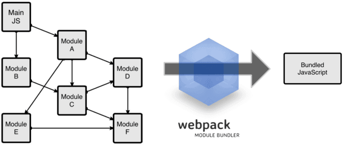

# WebPack

1. 一个js模块，可以用npm进行安装。
2. WebPack可以看做是模块打包机：它做的事情是，**分析你的项目结构** ，找到JavaScript模块以及其它的一些浏览器不能直接运行的拓展语言（Scss，TypeScript等），并将其  **转换和打包** 为合适的格式供浏览器使用。

　　Webpack的工作方式是：把你的项目当做一个整体，通过一个给定的主文件（如：index.js），Webpack将从这个文件开始找到你的项目的所有依赖文件，使用loaders处理它们，最后打包为一个（或多个）浏览器可识别的JavaScript文件。

即然是webpack是npm管理的一个包，所以自然可以使用`npm install`命令进行安装。




# 为什要使用WebPack

1. 模块化：很多JS模块都使用npm进行管理，并且es6语法可以用import来引入，还有CommonJs/AMD社区方案的require
2. 类似于TypeScript这种在JavaScript基础上拓展的开发语言：使我们能够实现目前版本的JavaScript不能直接使用的特性
3. CSS模块化： Scss，less等
4. ... ...

　　以上的特点大大的提高了我们的开发效率，但是利用它们开发的文件往往需要进行额外的处理才能让浏览器识别,而手动处理又是非常繁琐的，这就为WebPack类的工具的出现提供了需求。

比如我们使用了require来导入模块，那么浏览器是不可以直接使用的。那么我们可以使用以下命令做转换

```
# {extry file}出填写入口文件的路径，本文中就是上述main.js的路径，
# {destination for bundled file}处填写打包文件的存放路径
# 填写路径的时候不用添加{}
webpack {entry file} {destination for bundled file}
```
如下示例main.js引入greeter.js

```
app/Greater.js
module.exports = function() {
  var greet = document.createElement('div');
  greet.textContent = "Hi there and greetings!";
  return greet;
};
```

在main.js中用require引入

```
app/main.js
const greeter = require('./Greeter.js'); //和main.js在同一目录
document.querySelector("#root").appendChild(greeter());
```

然后使用 `webpack app/main.js public/bundle.js` webpack命令将main.js转成bundle.js，即浏览器可运行的js。里面的内容如下：

```
(function(modules) { // webpackBootstrap
 // The module cache
 var installedModules = {};

 // The require function
 function __webpack_require__(moduleId) {

   // Check if module is in cache
   if(installedModules[moduleId]) {
     return installedModules[moduleId].exports;
   }
   // Create a new module (and put it into the cache)
   var module = installedModules[moduleId] = {
     i: moduleId, // i mean moduleId
     l: false,  //l mean if load?
     exports: {}
   };

   // Execute the module function 即执行后面实参传入的回调函数,将模块的对象绑定到module.exports字典中
   modules[moduleId].call(module.exports, module, module.exports, __webpack_require__);

   // Flag the module as loaded
   module.l = true;

   // Return the exports of the module
   return module.exports;
 }


 // expose the modules object (__webpack_modules__)
 __webpack_require__.m = modules;

 // expose the module cache
 __webpack_require__.c = installedModules;

 // define getter function for harmony exports
 __webpack_require__.d = function(exports, name, getter) {  
   if(!__webpack_require__.o(exports, name)) {
     Object.defineProperty(exports, name, {
       configurable: false,
       enumerable: true,
       get: getter
     });
   }
 };

 // Load entry module and return exports
 return __webpack_require__(__webpack_require__.s = 0);
})
/*********************************后面是立即执行函数参数***************************************/
([
/* 0 */
/***/ (function(module, exports, webpack_require) {

//main.js
const greeter = webpack_require(1);
document.querySelector("#root").appendChild(greeter());

/***/ }),
/* 1 */
/***/ (function(module, exports) {

module.exports = function() {
 var greet = document.createElement('div');
 greet.textContent = "Hi there and greetings!";
 return greet;
};

/***/ })
]);
```

可以看到转换成了一个立即执行函数


然后在html文件中引入bundle.js如下,这样就可以使用转换后的js代码了。

```
//public/index.html
<!-- index.html -->
<!DOCTYPE html>
<html lang="en">
  <head>
    <meta charset="utf-8">
    <title>Webpack Sample Project</title>
  </head>
  <body>
    <div id='root'>
    </div>
    <script src="bundle.js"></script>
  </body>
</html>
```

参考: [入门Webpack，看这篇就够了](https://www.jianshu.com/p/42e11515c10f)
