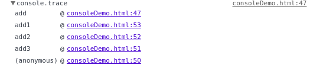

# console 命令

## 显示命令与占位符

　　使用log  info  error  warn等方法在console中输出数据的时候是可以使用占位符（%s，%d/%i,%f,%o）

```
console.log('hello');
console.info('info');
console.error('error');
console.warn('warn');
```
　　输出如下图所示，可以发现error和warn会有特殊标识


## 信息分组

　　使用group可以对输出信息进行分组

```
console.group("第一组信息");
console.log("第一组第一条");
console.log("第一组第二条");
console.groupEnd();
console.group("第二组信息");
console.log("第二组第一条");
console.log("第二组第二条");
console.groupEnd();
```

　　输出如下图所示


## 查看对象的信息

　　使用console.dir可以打出任意一个对像的整体结构.

```
var info={name:"myName", age:123};
console.dir(info);
```

　　info的整体结构如下图所示


## 显示某个节点的内容

　　获取到DOM元素节点后可以通过dirxml来输出该节点所包括的html/xml代码

```
<div id="info">
  <h3>info div</h3>
  <p>need to print something</p>
</div>

var infoDiv = document.getElementById('info');
console.dirxml(infoDiv);
```


## 判断变量是否是真

　　console.assert()用来判断一个表达式或变量是否为真。如果结果为否，则在控制台输出一条相应信息，并且抛出一个异常。

```
var result = 1;
console.assert(result);
console.assert(result===2); //output error exception
```


## 追踪函数的调用轨迹

　　如果想知道函数之间的调用链可以使用trace

```
/*函数是如何被调用的，在其中加入console.trace()方法就可以了*/
function add(a,b){
     console.trace();
　　　return a+b;
}
var x = add3(1,1);
function add3(a,b){return add2(a,b);}
function add2(a,b){return add1(a,b);}
function add1(a,b){return add(a,b);}
```

　　从下图可以发现调用链是逆序显示



## 计时功能

　　console.time()和console.timeEnd()，用来显示代码的运行时间。

```
console.time("控制台计时器一");
for(var i=0;i<1000;i++){
　　for(var j=0;j<1000;j++){}
}
console.timeEnd("控制台计时器一");
```

　　控制台输出如下图


## 性能分析

　　性能分析（Profiler）就是分析程序各个部分的运行时间，找出瓶颈所在，使用的方法是console.profile()。

## 用表格展示json数据

　　可以将如下json数据内容以表格的形式进行展示

```
var data = [{"name": "Bob","age": 8, "sex":{"a":1}},{"name": "Roce","age": 15, "sex":{"a":1}},{"name": "Blu","age": 10, "sex":{"a":1}}];
console.table(data);
```

输出如下:


